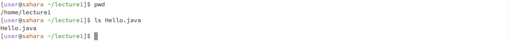

# Lab Report 1 - Remote Access and FileSystem (Week 1)

## Requirements
For each of the commands `cd`, `ls`, and `cat`, and using the workspace you created in this lab:
+ Share an example of using the command with no arguments.
+ Share an exmaple of using the command with a path to a directory as an argument.
+ Share an example of using the command with a path to a file as an argument. \

For each, include:
+ A screenshot or Markdown code block showing the command and its output
+ What the working directory was when the command was run
+ A sentence or two explaining why you got that output (e.g. what was in the filesystem, what it meant to have no arguments).
+ Indicate whether the output is an error or not, and if it’s an error, explain why it’s an error.

## Results
### For commands with no arguments
#### cd

My initial working directory is `/home/lecture1`

When I use `cd` command with no arguments, the working directory changes to the home directory. There is no error and no output by executing this command.

#### ls

My working directory is `/home`

When I use `ls` command with no arguments, the output display all the files under `/home` directory. This is no error. In my case, there is a file in blue, so I know there is a **lecture** directory under my home directory.

#### cat

My working directory is `/home`

When I used `cat` commend with no arguments, it starts with a new line. There is no output in this case. I type in a series of test sentences, it repeats what I typed in and starts with a new line when I end with a return button. Afterwards, I type in 'cool' and press Ctrl+D, it repeats my input in the same line. There is no error in the process.

### For commands with a path to a directory as an argument
#### cd

My initial working directory is `/home`

When I use `cd` command follow with the `lecture1` directory, the working directory change to `/home/lecture1`. There is no error and no output by executing this command.

#### ls

My working directory is `/home/lecture1`

When I use `ls` command follow with the `lecture1` directory, the output displayed all the files under `/home/lecture1` directory. There is no error, and there are four files under the `lecture1` directory.

#### cat

My working directory is `/home/lecture1`

When I use `cat` command follow with the `lecture1` directory, it displays 'cat: messages/: Is a directory'. This is an error that the `cat` command should not follow by a directory path.

### For commands with a path to a file as an argument
#### cd

My initial working directory is `/home/lecture1`

When I use `cd` command follow with the `Hello.java` file, it displays 'bash: cd: Hello.java: Not a directory'. This is an error that the `cat` command should not follow by a file path.

#### ls

My working directory is `/home/lecture1`

When I use `ls` command follow with the `Hello.java` file, the output displays the file name 'Hello.java'. There is no error occured.

#### cat

My working directory is `/home/lecture1`

When I use `cat` command follow with the `Hello.java` file, it displays all the file content in 'Hello.java' file. There is no error displayed.

