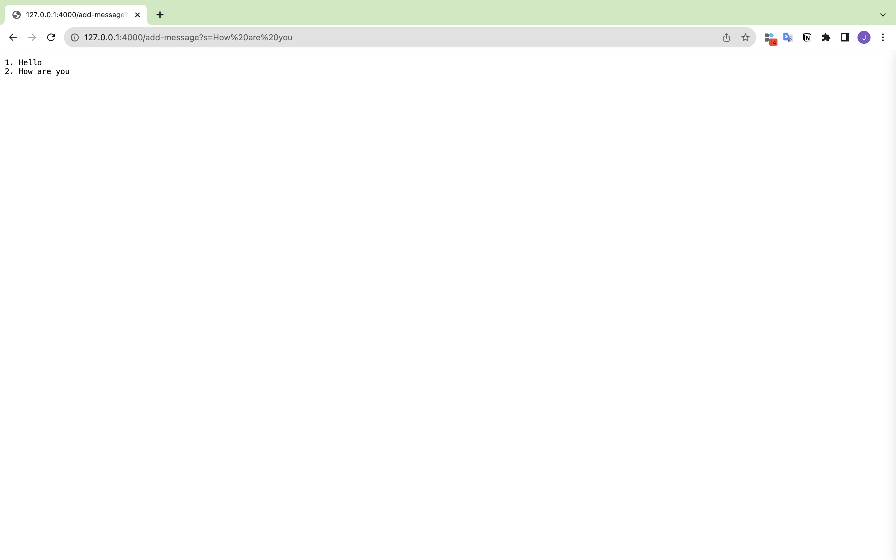
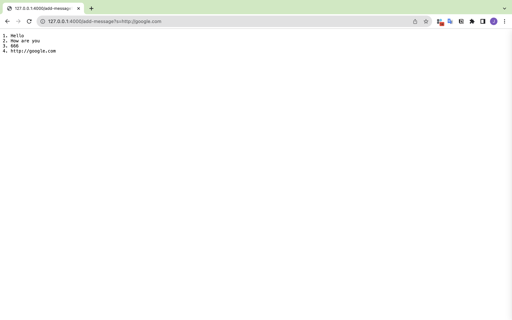
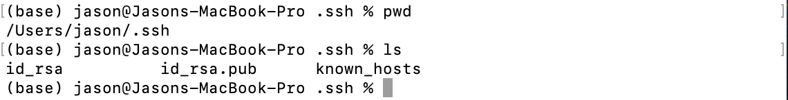
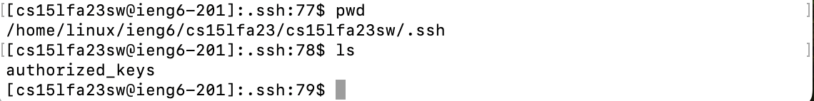
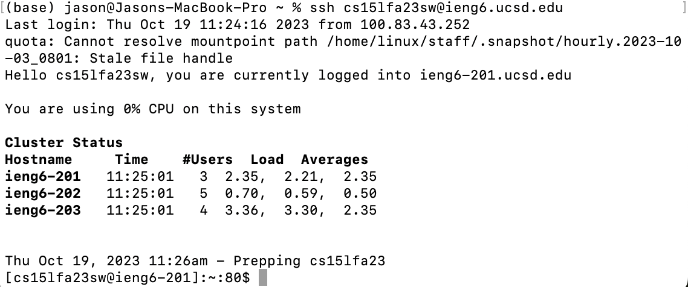

# Lab Report 2 - Servers and SSH Keys (Week 3)
## Part 1
### Code
```
import java.io.IOException;
import java.net.URI;
import java.util.ArrayList;

class Handler implements URLHandler {
    // The one bit of state on the server: a number that will be manipulated by
    // various requests.
    int num = 0;
    // Initialize the response string
    String resString = "";

    public String handleRequest(URI url) {
        if (url.getPath().equals("/")) {
            return this.resString;
        } else if (url.getPath().equals("/add-message")) {
            String[] parameters = url.getQuery().split("=");
            if (parameters[0].equals("s")){
                num += 1;
                this.resString += this.num + ". " + parameters[1].toString() + "\n";
            }
            return resString;
        } else {
            return "404 Not Found!";
        }
    }
}

class StringServer {
    public static void main(String[] args) throws IOException {
        if(args.length == 0){
            System.out.println("Missing port number! Try any number between 1024 to 49151");
            return;
        }

        int port = Integer.parseInt(args[0]);

        Server.start(port, new Handler());
    }
}
```
### Result

The function `handleRequest(URL)` is called when executing the url `https://127.0.0.1:4000/add-message?s=How%20are%20you`

Arguments, values and changes:

`handleRequest(URI)`

+ Argument: url
+ Value: `new URI("https://127.0.0.1:4000/add-message?s=How%20are%20you")`
+ Change(s):

  The variable `num` is changed from 1 to 2
  
  The variable `resString` is changed from `1. Hello\n` to `1. Hello\n2. How are you\n`


The function `handleRequest(URL)` is called when executing the url `https://127.0.0.1:4000/add-message?s=http://google.com`

Arguments, values and changes:

`handleRequest(URI)`

+ Argument: url
+ Value: `new URI("https://127.0.0.1:4000/add-message?s=http://google.com")`
+ Change(s):

  The variable `num` is changed from 3 to 4
  
  The variable `resString` is changed from `1. Hello\n2. How are you\n3. 666` to `1. Hello\n2. How are you\n3. 666\n4. http://google.com`

## Part 2
The path to the private key for your SSH key for logging into `ieng6`

The path to the public key for your SSH key for logging into `ieng6`

A terminal interaction where you log into ieng6 with your course-specific account without being asked for a password.


## Part 3
It is real cool to save the private key on my own computer and public key on the remote computer to skip the step of tying in password everytime. I didn't know this before, this can save us time when login.
