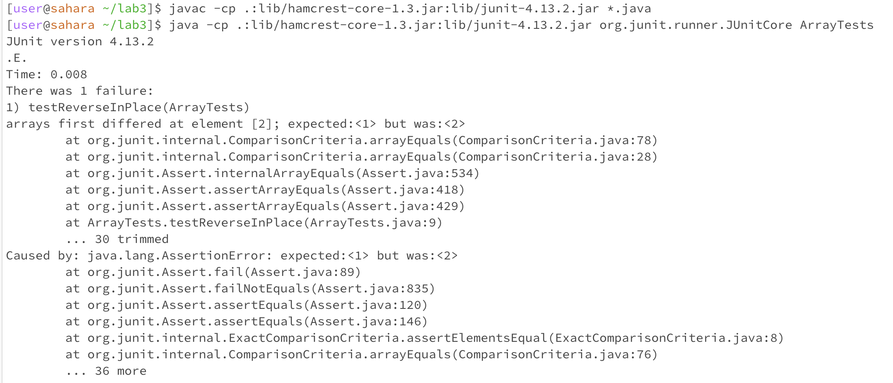

# Lab Report 3 - Bugs and Commands
## Part 1 - Bugs
**A failure-inducing input for the buggy program** 

`reversed(int[] )` function under `ArrayExample` file
```
  static int[] reversed(int[] arr) {
    int[] newArray = new int[arr.length];
    for(int i = 0; i < arr.length; i += 1) {
      arr[i] = newArray[arr.length - i - 1];
    }
    return arr;
  }
```
test case
```
@Test 
	public void testReverseInPlace() {
    int[] input1 = { 1, 3, 2 };
    ArrayExamples.reverseInPlace(input1);
    assertArrayEquals(new int[]{ 2, 3, 1 }, input1);
	}
```

**An input that doesn’t induce a failure, as a JUnit test and any associated code**

`reversed(int[] )` function under `ArrayExample` file
```
  static int[] reversed(int[] arr) {
    int[] newArray = new int[arr.length];
    for(int i = 0; i < arr.length; i += 1) {
      arr[i] = newArray[arr.length - i - 1];
    }
    return arr;
  }
```
test case
```
@Test 
	public void testReverseInPlace() {
    int[] input1 = { 3 };
    ArrayExamples.reverseInPlace(input1);
    assertArrayEquals(new int[]{ 3 }, input1);
	}
```

**The symptom, as the output of running the tests**


Symptom: Assertion error.

**The bug, as the before-and-after code change required to fix it**

Before
```
  // Changes the input array to be in reversed order
  static void reverseInPlace(int[] arr) {
    for(int i = 0; i < arr.length; i += 1) {
      arr[i] = arr[arr.length - i - 1];
    }
  }

  // Returns a *new* array with all the elements of the input array in reversed
  // order
  static int[] reversed(int[] arr) {
    int[] newArray = new int[arr.length];
    for(int i = 0; i < arr.length; i += 1) {
      arr[i] = newArray[arr.length - i - 1];
    }
    return arr;
  }
```

After
```
  // Changes the input array to be in reversed order
  static void reverseInPlace(int[] arr) {
    for(int i = 0; i < arr.length/2; i += 1) {
      int temp = arr[i];
      arr[i] = arr[arr.length - i - 1];
      arr[arr.length - i - 1] = temp;
    }
  }

  // Returns a *new* array with all the elements of the input array in reversed
  // order
  static int[] reversed(int[] arr) {
    int[] newArray = new int[arr.length];
    for(int i = 0; i < arr.length; i += 1) {
      newArray[i] = arr[arr.length - i - 1];
    }
    return newArray;
  }
```
Both two of the functions overwrote original data and cause the loss of data. Using a temprary variable to store the element, or write the sorted data into a new array can fix this problem.

## Part 2 - Researching Commands
1. `grep -i` --ignore-case: Ignores case distinctions in patterns and input data.

**Input**
```
grep -i "Waddington" journal.pbio.0020019.txt
```
**Output**
```
	environmental variation (Waddington 1942). Clearly, such a mechanism would have important
        some way to explain the original observation by Waddington (1942) of phenotypic constancy,
```
We don't need to care about the Upper and lower case of the matched pattern when we need to search it in a long text file.
**Input**
```
grep -i "inside" chapter-1.txt
```
**Output**
```
INSIDE THE FOUR FLIGHTS
    Because several passengers on United 93 described three hijackers on the plane, not four, some have wondered whether one of the hijackers had been able to use the cockpit jump seat from the outset of the flight. FAA rules allow use of this seat by documented and approved individuals, usually air carrier or FAA personnel. We have found no evidence indicating that one of the hijackers, or anyone else, sat there on this flight. All the hijackers had assigned seats in first class, and they seem to have used them. We believe it is more likely that Jarrah, the crucial pilot-trained member of their team, remained seated and inconspicuous until after the cockpit was seized; and once inside, he would not have been visible to the passengers.
    Inside the National Military Command Center, the deputy director of operations and his assistant began notifying senior Pentagon officials of the incident. At about 9:00, the senior NMCC operations officer reached out to the FAA operations center for information. Although the NMCC was advised of the hijacking of American 11, the scrambling of jets was not discussed.
The Pentagon Teleconferences. Inside the National Military Command Center, the deputy director for operations immediately thought the second strike was a terrorist attack. The job of the NMCC in such an emergency is to gather the relevant parties and establish the chain of command between the National Command Authority-the president and the secretary of defense- and those who need to carry out their orders.
    Inside the NMCC, the deputy director for operations called for an allpurpose "significant event" conference. It began at 9:29, with a brief recap: two aircraft had struck the World Trade Center, there was a confirmed hijacking of American 11, and Otis fighters had been scrambled. The FAA was asked to provide an update, but the line was silent because the FAA had not been added to the call. A minute later, the deputy director stated that it had just been confirmed that American 11 was still airborne and heading toward D.C. He directed the transition to an air threat conference call. NORAD confirmed that American 11 was airborne and heading toward Washington, relaying the erroneous FAA information already mentioned. The call then ended, at about 9:34.
    Once inside, Vice President Cheney and the agents paused in an area of the tunnel that had a secure phone, a bench, and television. The Vice President asked to speak to the President, but it took time for the call to be connected. He learned in the tunnel that the Pentagon had been hit, and he saw television coverage of smoke coming from the building.
```
It is convenient to find all the lower case and upper case words in the long context.
2. `grep -n` --line-number: Prefix each line of the matching output with the line number in the input file.

**Input**
```
grep -n "Tuesday" chapter-1.txt
```
**Output**
```
6:    Tuesday, September 11, 2001, dawned temperate and nearly cloudless in the eastern United States. Millions of men and women readied themselves for work. Some made their way to the Twin Towers, the signature structures of the World Trade Center complex in New York City. Others went to Arlington, Virginia, to the Pentagon. Across the Potomac River, the United States Congress was back in session. At the other end of Pennsylvania Avenue, people began to line up for a White House tour. In Sarasota, Florida, President George W. Bush went for an early morning run.
62:    They were planning to hijack these planes and turn them into large guided missiles, loaded with up to 11,400 gallons of jet fuel. By 8:00 A.M. on the morning of Tuesday, September 11,2001, they had defeated all the security layers that America's civil aviation security system then had in place to prevent a hijacking. The Hijacking of American 11 American Airlines Flight 11 provided nonstop service from Boston to Los Angeles. On September 11, Captain John Ogonowski and First Officer Thomas McGuinness piloted the Boeing 767. It carried its full capacity of nine flight attendants. Eighty-one passengers boarded the flight with them (including the five terrorists).22 The plane took off at 7:59. Just before 8:14, it had climbed to 26,000 feet, not quite its initial assigned cruising altitude of 29,000 feet. All communications and flight profile data were normal. About this time the "Fasten Seatbelt" sign would usually have been turned off and the flight attendants would have begun preparing for cabin service.
170:    On the morning of 9/11, there were only 37 passengers on United 93-33 in addition to the 4 hijackers. This was below the norm for Tuesday mornings during the summer of 2001. But there is no evidence that the hijackers manipulated passenger levels or purchased additional seats to facilitate their operation.
```
We can quickly locate the pattern through the `grep -n` command.
**Input**
```
grep -ni "wtc" chapter-9.txt
```
**Output**
```
14:            The World Trade Center (WTC) complex was built for the Port Authority of New York and
18:            The WTC actually consisted of seven buildings, including one hotel, spread across 16
20:                The Twin Towers (1 WTC, or the North Tower, and 2 WTC, or the South Tower) were the
49:            The 1993 Terrorist Bombing of the WTC and the Port Authority's Response. Unlike most
71:                rescues were part of the WTC evacuation plan and that rescue from the roof was a
74:                into the WTC fire safety plan.
78:                technological improvements to the WTC, as well as to enhance its fire safety plan
117:            Six weeks before the September 11 attacks, control of the WTC was transferred by net
124:                the WTC on September 11, the WTC fire safety plan remained essentially the
145:                utilized at a major incident at the WTC. In particular, there were no standard
204:            The FDNY's radios performed poorly during the 1993 WTC bombing for two reasons.
216:                Authority police desk in 5 WTC, to be activated by members of the Port Authority
217:                police when the FDNY units responding to the WTC complex so requested. However, in
242:            The OEM's headquarters was located at 7WTC. Some questioned locating it both so close
354:            Civilians who called the Port Authority police desk located at 5 WTC were advised to
397:                safety for the WTC complex perished in the South Tower's collapse. Clearly, however,
410:            Several South Tower occupants called the Port Authority police desk in 5 WTC. Some
436:                commissioners arrived at the WTC before 10:00.
515:                being set up around the perimeter of the WTC. Some entered the lobby to respond to
517:                hospitals were rushing to the WTC complex.
524:                to level 4, thereby sending to the WTC approximately 22 lieutenants, 100 sergeants,
534:            At 8:50, the Aviation Unit of the NYPD dispatched two helicopters to the WTC to
546:            By 9:00, a third NYPD helicopter was responding to the WTC complex. NYPD helicopters
576:                access the WTC. The NYPD and PAPD coordinated the closing of bridges and tunnels
583:                officers in the WTC Command to meet at the police desk in 5 WTC. Soon thereafter, he
586:                given WTC Command radios.
588:            One Port Authority police officer at the WTC immediately began climbing stairwell C
592:                and in the PATH (Port Authority Trans-Hudson) station below the WTC complex.
594:                tunnels, and airport commands began responding to the WTC. The PAPD lacked written
596:                WTC during a major incident. In addition, offi cers from some PAPD commands lacked
600:            At 9:00, the PAPD commanding officer of the WTC ordered an evacuation of all
602:                calamity in the North Tower. This order was given over WTC police radio channel W,
609:            By 8:48, officials in OEM headquarters on the 23rd floor of 7 WTC-just to the north
628:            At 9:03:11, the hijacked United Airlines Flight 175 hit 2 WTC (the South Tower) from
740:                and then out of the WTC complex.
768:                third party was not at the WTC, but had been in phone contact with the group on the
812:                the WTC.
832:            At 9:05, FDNY chiefs tested the WTC complex's repeater system. Because the second
960:                very close to the WTC complex-were not dispatched after the plane hit the South
965:                believed that the South Tower was 1 WTC when in fact it was 2 WTC.) Sixth, some
974:                that lobby. But because of his lack of familiarity with the WTC complex and
1050:                additional 20 engine and 6 ladder companies were sent to the WTC. As a result, more
1051:                than one-third of all FDNY companies now had been dispatched to the WTC. At about
1053:                engineer in front of 7 WTC had just remarked that the Twin Towers in fact were in
1082:                entered the South Tower. By 9:59, a fifth ESU team was next to 6 WTC and preparing
1116:                then out of the WTC complex. This exit route ensured that civilians would not be
1120:            Some officers positioned themselves at the top of a flight of stairs by 5WTC that led
1149:                further confused the substance of the 911 call by telling NYPD officers at the WTC
1152:                precincts in the vicinity of the WTC and subsequently on the Special Operations
1156:            Initial responders from outside PAPD commands proceeded to the police desk in 5 WTC
1184:                complex-some assisting in evacuation, others manning the PAPD desk in 5 WTC or
1190:                evacuated from 7 WTC. At approximately 9:30, a senior OEM official ordered the
1191:                evacuation of the facility, after a Secret Service agent in 7 WTC advised him that
1366:                West Street to continue running north, well away from the WTC. Three of the most
1372:                immediately after it happened, and further advised that all people in the WTC
1382:                moved further from the WTC at 10:06.
1386:                post at Church and Vesey ordered the evacuation of all ESU units from the WTC
1413:                time to 6 WTC, dodging those who still were jumping from the upper floors of the
1419:                (who had exited from the NorthTower mezzanine) to evacuate the WTC complex by
1420:                descending the stairs on the north side of 5 and 6 WTC, which led down to Vesey
1440:                least one NYPD officer from this area managed to evacuate out toward 5 WTC, where he
1442:                the civilians who were still exiting when they could safely run from 1 WTC to 5 WTC
1453:                PAPD officers without WTC Command radios received an evacuation order by radio. Some
1568:                Port Authority, WTC employees, and the building occupants themselves did their best
1575:                estimation that between 16,400 and 18,800 civilians were in the WTC complex as of
1576:                8:46 A.M. on September 11. At most 2,152 individuals died at the WTC complex who
1578:                of the WTC or individual companies, (3) volunteer civilians who ran to the WTC after
1585:                WTC does not definitively indicate where that individual died that morning or
1639:            The WTC lacked any plan for evacuation of civilians on upper floors of the WTC in the
1693:                the WTC on September 11.
1710:                and PAPD personnel would be in charge of evacuating civilians from the WTC complex
1712:                by clearing emergency lanes to the WTC.
1727:                not always the case at the WTC on 9/11.
1738:                the WTC and from confusion over which personnel were assigned to which frequency.
1753:                its elite personnel, at the WTC. The PortAuthority's response was hampered by the
1755:                commands to respond in unified fashion to an incident at the WTC. Many officers
1757:                issued over the WTC Command frequency. In addition, command and control was
1772:                WTC were as well coordinated.
1802:                began to evacuate the WTC complex prior to that time. Furthermore, the FDNY, as an
1807:            The FDNY, PAPD, and NYPD did not coordinate their units that were searching the WTC
```
`grep -ni` command can match case insensitive patterns and locate their lines.
3. `grep -w` Find the exact matching word from the input file or string.

**Input**
```
grep -w "prepare" chapter-9.txt
```
**Output**
```
            The Port Authority also sought to prepare civilians better for future emergencies.
                to prepare ourselves to meet it.
```
If I only want some specific pattern in my result, I can use "grep -w"
**Input**
```
grep -wi "how" chapter-13.1.txt
```
**Output**
```
            HOW TO DO IT? A DIFFERENT WAY OF ORGANIZING THE GOVERNMENT
                together in analyzing a case and planning how to manage it.
            In our first section, we concentrated on counterterrorism, discussing how to combine
                    of quality in how it is collected, processed (e.g., translated), reported,
                    less able to influence how these technical resources are allocated and used.
                    study. Even the most basic information about how much money is actually
                powerful CEO who has significant control over how money is spent and can hire or
                    the broad allocation of how these tens of billions of dollars have been assigned
                Congress have the broad knowledge of intelligence activities or the know-how about
                the place of speculation. In our report we have shown how agents in Phoenix,
```
Find all the word only and case insensitive.
4. `grep -c` Count the number of occurrences of the provided pattern.

**Input**
```
grep -c "Portland" chapter-1.txt 
```
**Output**
```
3
```
Count the specific pattern in the file.
**Input**
```
grep -ciw "atta" chapter-1.txt
```
**Output**
```
10
```
return any occurrence of the word "anna", case insensitive.
## Citation
Grep Command in Linux, Zaira Hira, https://www.freecodecamp.org/news/grep-command-in-linux-usage-options-and-syntax-examples/
