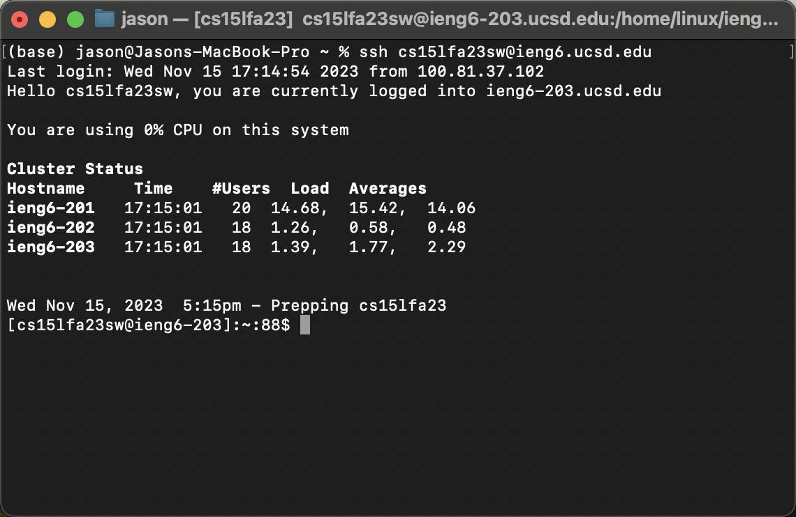
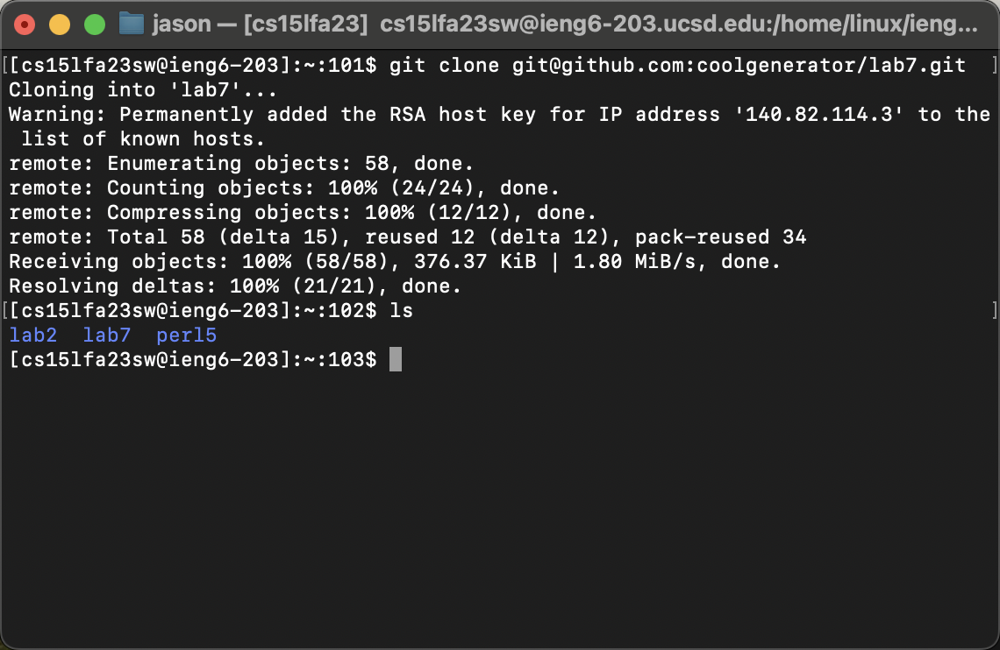
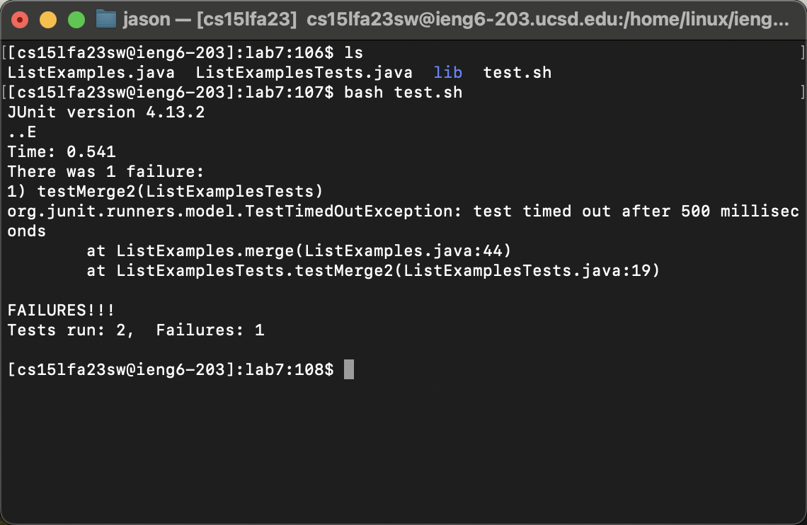
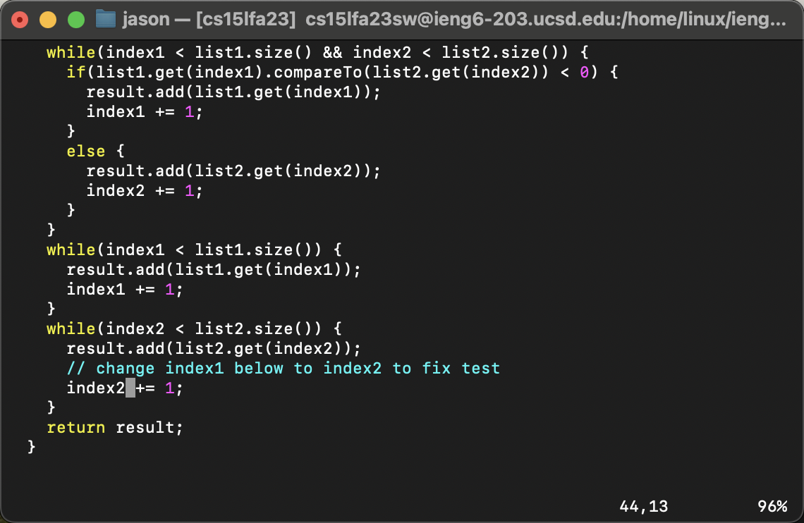
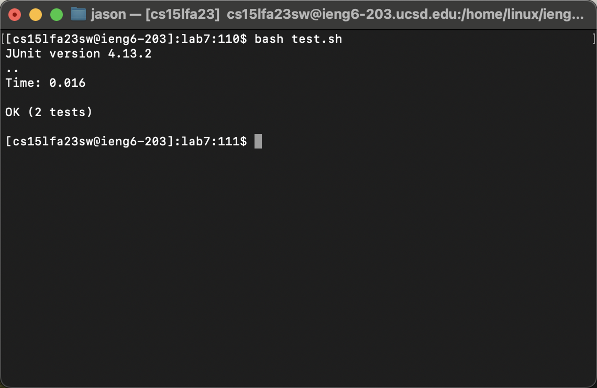
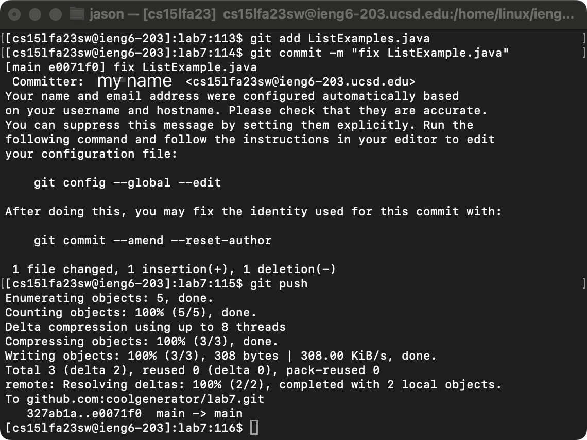

# Lab Report 4 - Vim

## Steps

### 1. Log into ieng6


I use `ssh <myUserID>@ieng6.ucsd.edu` command to access to my account, and press `<enter>`, then the secure shell connect me to the remote sever.

### 2. Clone my fork of the repository from my Github account (using the SSH URL)


**Preparation:**

Firstly, I use `ssh-keygen<enter>` command to create a private SSH Key file on ieng6 for accessing Github. It will show the “randomart image”

Secondly, I type in `cat <path of your ssh key .pub file><enter>` to look up my SSH public key. I copy the public key to my clipboard.

After that, I log in to my github account, and then find `Settings > Access > SSH and GPG keys > New SSH key`. I give it a title ieng6, and paste the public key.

Then I come back to ieng6 sever, and type in `ssh-keyscan -t rsa github.com >> ~/.ssh/known_hosts<enter>`, it will add Github.com as a recognized host.

**Run the command:**

After all the preparations are completed, I use SSH clone URL this time, and run the command `git clone git@github.com:coolgenerator/lab7.git<enter>` on the ieng6 sever. 

The SSH clone method will allow both cloning and pushing to the repository.

### 3. Run the tests, demonstrating that they fail


I use `cd lab7<enter>` command to change directory to the lab7, and use `ls` to check all the existing files and directories.

Then I type in `bash test.sh<enter>` to run the shell sript. It shows that there is 1 failure with the code.

### 4. Edit the code file to fix the failing test


I use `vim` command to edit the failing test. I run the command `vim ListExamples.java<enter>`, and it goes into vim command mode.

Under vim command mode,  use `/index1<enter>` to match the pattern `index1`. And then press `nnnnnnnn` to locate the area that need to be fixed.

After locating the pattern, I press `el` to move the cursor to the end of the word. Then I press `i` to change into insertion mode, and type `<delete>2` to change the word `index1` into `index2`.

After that, I press `esc` to go back to the command mode, and then type in `:wq` to save the quit the file.

**All the keys I pressed under vim mode**
```
/index1<enter>
nnnnnnnn
e
l
i
<delete>
2
esc
:wq
```

### 5. Run the tests, demonstrating that they now succeed


Now I run `bash test.sh` again, it will show 'OK', it means all the tests are passed.

### 6. Commit and push the resulting change to your Github account


I type in `git add ListExample.java<enter>` to stage change for the next commit.

Then I use `git commit -m "fix ListExample.java"` to commit it with a message.

After all of these have been done, I use `git push` to push the update to my Github repository.
