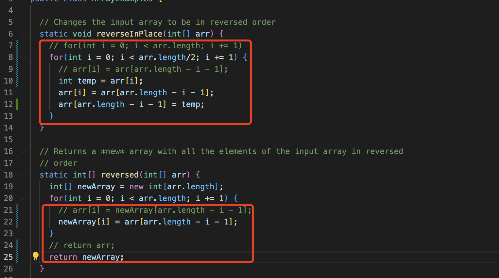

# Lab Report 5 - Putting it All Together
## Debugging Scenario
### The original post from the student
I added two test cases in my test file, but both of them failed. It says assertion error and unexpected value. But the original test cases get through, I don't know why. It seems like the results from the java code are different from what we expected.

### A response from a TA
Yes, your intuition is true. You can go back to your `ArrayExample.java` and check if there is any logic error in your code. If there is any, you may need to fix that error first, compile all the java file, and rerun the test file again.

### Reason for the bug
Thank you for your response. I went back to the java file you mentioned, there are indeed two logical errors. And the test file passed after I fixed all the logical errors.

Here is my file directory structure:

The contents of each file before fixing the bug:

How I trigger the bug:

How to fix the bug:
The function of this script is quite simple, so I think it is highly possible that there are some logical error within `reverseInPlace` and `reversed` functions. 

I read the code through, and found the for loop for `reverseInPlace` function shoud be from 0 to arr.length/2. And there should be a temp variable in `reverseInPlace` function. Also, the place of newArray and arr in `reversed` function should be switched, and return the value of newArray.

I fixed all the logical errors, and run the test file again. All passed!

## Reflection
It is so amazing to use bash script to do the grading work. I used to think the bash script can only help us simplify our workflow, but never expect it complicated work like running the tests for all the submissions, extracting error message into one file, and put all the passed results into another file. 
