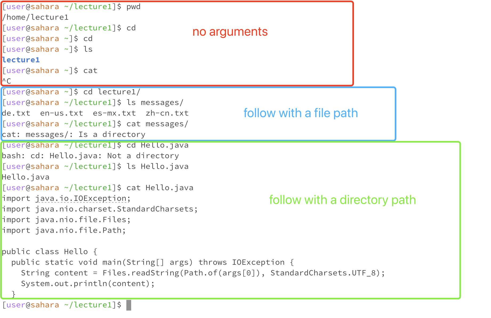

## Requirements
For each of the commands `cd`, `ls`, and `cat`, and using the workspace you created in this lab:
+ Share an example of using the command with no arguments.
+ Share an exmaple of using the command with a path to a directory as an argument.
+ Share an example of using the command with a path to a file as an argument.

## Results
My working directory is `/home/lecture1`

